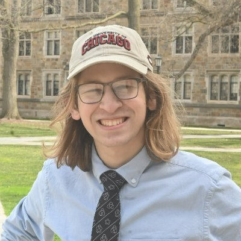

## Hi all!

  

I'm Josh (they/them), a Winter '22 graduate of the University of Michigan's College of Engineering and the lab manager for the [Welch Lab](https://welch-lab.github.io/) in the Medical School. I aspire to develop new experimental and computational methodologies for the high throughput analysis of cultured and uncultured environmental microbiomes.

### [CV](files/jsodicoff_CV_2022_v4.pdf)

### [Posters](posters.md)

### [Presentations](presentations.md)

### [Reports and other writing](reports.md)

### [Contact](contact.md)
