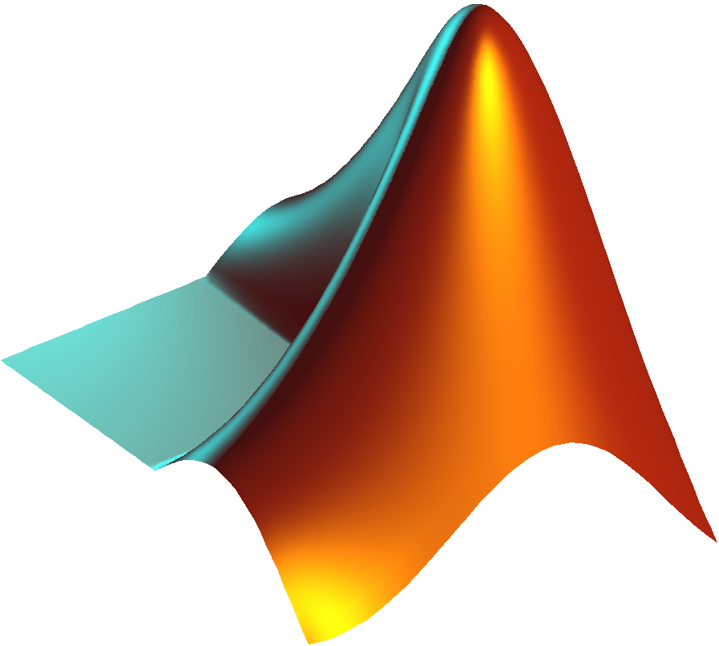

## Skills

### Computational

* 
  * Proficient in data analysis and visualization in R. Here's a few specific useful skills I also know:
    * Package deployment
    * Shiny applications
    * RMarkdown
    * Rcpp
    * ggplot2
* 
  * Highly knowledgeable about the STL
  * Able to create command line tools
  * Skilled in complexity analysis
  * Can profile code performance with Valgrind, perf
  * Can integrate functionality into R with Rcpp
*  
  * Have a working knowledge of the language overall
  * Able to design and train neural networks using PyTorch
*  
  * Can apply to the modelling and solution of differential equations
  * Experienced in the use the Statistics and Machine Learning Toolbox
* Additional
  * Experience running jobs on a high performance computing cluster
  * Basic bash scripting

### Lab
* Cell culture techniques for eukaryotic cells
* Genetic modification of T cells
* Killing assay
* ELISA
* Breadboarding
* Experimental design

### Logistics
* Grading code and scientific reports
* Study group facilitation
* Office hours faciliation
* Curricular material writing
*  and Markdown

### Certifications

Up to date on

* General Lab Safety
* Autoclave Operations and Safety Procedures
* Biosafety and Bloodborne Pathogens
* Responsible Conduct of Research and Scholarship
* Covid 19: Working Safely in U-M Research Labs

trainings, provided by UMich EHS
